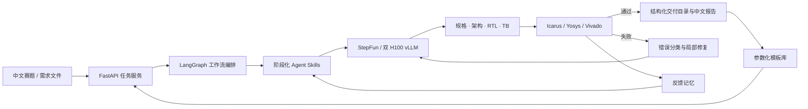

# SiliconForge · 数字 IC 智能体

SiliconForge 是面向数字 IC 与 FPGA 设计的可验证工程智能体。用户只需输入赛题或自然语言需求，系统即可完成需求理解、接口与时序契约设计、微架构规划、RTL 生成、自检 Testbench 生成、真实 EDA 仿真/综合、错误归因、定向修复和中文交付报告，并把一次任务整理为可下载、可继续编辑的工程目录。项目采用“模型负责推理与生成、工具负责验证、反馈负责改进、模板负责复用”的闭环，不把一段看似合理的代码当作最终答案，而是让每一次交付都带有可追溯的规格、源码、日志、审查结论与运行清单。

项目提供中文 Web GUI、VS Code 风格代码工作台、任务队列、实时进度、产物预览、完整 ZIP 下载、五类盲测集和个人参数化模板库。首页采用个人照片与 3D 旋转相册背景，用户可以上传自己的 JPG、PNG 或 WebP 照片，一键生成专属界面；照片在浏览器本地压缩和保存，不影响 Agent 的工程执行。开发环境可在 Windows 上直接运行，生产环境已部署在双 NVIDIA H100 服务器上，通过 vLLM 提供 OpenAI 兼容的本地推理服务，并以张量并行方式使用两张 GPU。

## 核心亮点

- **一题一键闭环**：自然语言赛题直接进入需求、架构、RTL、TB、EDA、修复、审查与报告流水线。
- **真实工具验证**：Icarus Verilog、Yosys 与 Vivado 适配链路提供仿真、综合和日志证据。
- **Agent Skills 分层**：时钟复位、接口握手、位宽与有符号数、FSM ownership、资源推断、可观测性、TB 自检和局部修复等技能按阶段注入。
- **质量反馈记忆**：失败指纹、错误类别和关联技能被结构化记录，后续任务自动复用经验。
- **参数化模板资产**：组合运算、FSM、FIFO、协议控制器和修复任务可零 Token 实例化；高质量交付可一键沉淀到个人模板库。
- **工程化交付**：每个任务统一输出 `rtl/`、`tb/`、`doc/`、`logs/`、`meta/`、`eda/`，支持在线编辑、重跑 EDA 和一键下载。
- **多模型运行时**：支持阶跃星辰 OpenAI-compatible Chat Completions，也支持双 H100 上的 vLLM 本地模型。
- **个性化产品界面**：作者照片、3D 旋转背景和一键照片换肤共同构成可定制的个人数字 IC 助手。

## 系统架构



更完整的分层、数据流和闭环设计见 [系统架构说明](docs/ARCHITECTURE.md)。比赛要求中的 Skill Markdown 位于 [skills/digital-ic-verified-design/SKILL.md](skills/digital-ic-verified-design/SKILL.md)。

## 快速体验（Windows）

### 一键打开

双击根目录中的 `打开数字IC-Agent网页.cmd`。脚本会启动本地服务并打开：

```text
http://127.0.0.1:8000/
```

### 命令行启动

```powershell
python -m venv .venv
.\.venv\Scripts\Activate.ps1
python -m pip install --upgrade pip
python -m pip install -e .
python -m digital_ic_agent serve --host 127.0.0.1 --port 8000
```

浏览器进入首页后，可以上传个人照片完成主题换肤，也可以进入“完整闭环”输入赛题并提交。需求文本和任务文件二选一即可，Agent 会自行完成接口与架构设计。

## 双 H100 部署

生产部署由两个容器组成：Agent 容器提供 GUI、任务服务与 EDA 编排；vLLM 容器在两张 H100 上加载本地模型，并通过 `--tensor-parallel-size 2` 提供推理接口。

```bash
cp .env.server.example .env.server
docker compose -f compose.yaml -f compose.h100.yaml up -d --build
docker compose -f compose.yaml -f compose.h100.yaml ps
```

默认访问地址为 `http://服务器地址:8000/`。服务器驱动、NVIDIA Container Toolkit、模型缓存、端口开放、健康检查和更新流程见 [部署说明](docs/DEPLOYMENT.md)。

`127.0.0.1` 只供本机访问。互联网用户应访问双 H100 服务器的公网域名或公网 IP；GitHub 负责分发源码，不负责运行这个包含 Python、模型和 EDA 的后端服务。推荐由 Nginx/Caddy 将 HTTPS 域名反向代理到 Agent 的 8000 端口。

实验室服务器没有公网 IP 时，可叠加 `compose.tunnel.yaml` 使用 Cloudflare Tunnel，将 HTTPS 域名安全转发至 Compose 网络中的 `agent:8000`，无需开放入站端口。完整配置见 [无公网 IP 部署步骤](docs/DEPLOYMENT.md#无公网-ipcloudflare-tunnel--https-域名)。

## 标准交付目录

```text
runs/<task-id>/
├─ rtl/                 # 可综合 RTL
├─ tb/                  # 自检 Testbench 与 oracle 适配
├─ doc/                 # 规格、架构、交付报告、Skill 卡
├─ logs/                # 模型、仿真、综合与修复日志
├─ meta/                # manifest、反馈、质量证据
└─ eda/                 # EDA 中间结果与报告
```

GUI 的代码工作台可浏览和修改核心文件，保存后直接重跑 EDA；任务详情页可以下载完整 ZIP，也可以调用本机 VS Code 打开输出目录。

## 五类盲测与模板库

`benchmarks/blind_v1/` 覆盖五种高频数字 IC 任务：组合运算、FSM、FIFO、协议控制器和 RTL 修复。盲测只向 Agent 暴露题目，独立 oracle 在生成结束后评分，用于衡量 Pass@1、修复成功率和闭环稳定性。

```powershell
python -m digital_ic_agent benchmark-run `
  --suite-dir benchmarks/blind_v1 `
  --output-dir runs/blind_v1
```

同类高频设计也被整理为参数化模板。用户调整位宽、深度等参数即可生成 RTL/TB 并运行 EDA；一次成功任务还可以从界面加入个人模板库，形成面向个人工作场景持续增长的设计资产。

## 模型与运行配置

主要环境变量：

| 变量 | 用途 |
|---|---|
| `DIGITAL_IC_AGENT_BASE_URL` | OpenAI-compatible API 地址 |
| `DIGITAL_IC_AGENT_API_KEY` | 模型服务密钥 |
| `DIGITAL_IC_AGENT_MODEL` | 模型名称 |
| `DIGITAL_IC_AGENT_LLM_TRANSPORT` | `chat`、`auto` 或 `responses_background` |
| `DIGITAL_IC_AGENT_LLM_TIMEOUT_SECONDS` | 单次模型调用超时 |
| `DIGITAL_IC_AGENT_LLM_MAX_ATTEMPTS` | 超时与瞬态错误重试次数 |
| `DIGITAL_IC_AGENT_LLM_FALLBACK_MODEL` | 降级模型 |
| `DIGITAL_IC_AGENT_ALLOW_SHARED_LLM` | 是否允许登录用户共享服务端模型配置，默认 `false` |

阶跃星辰使用 `chat`。公开服务默认要求每位登录用户在会话中填写自己的 API Key，不会回落到项目所有者的远程付费 Key。双 H100 部署由 `compose.h100.yaml` 自动把 Agent 指向本地 vLLM，并显式开启共享本地模型；该路径使用服务器 GPU，不调用 StepFun 额度。密钥和服务器口令写入本地 `.env` 或 `.env.server`，这两类文件已由 Git 忽略。

## 技术栈

- **智能体与服务**：Python 3.11+、LangGraph、LangChain、FastAPI、Pydantic、Uvicorn
- **模型推理**：StepFun OpenAI-compatible API、vLLM、NVIDIA H100 × 2、CUDA、NVIDIA Container Toolkit
- **EDA 工具**：Icarus Verilog、Yosys、Vivado 适配
- **前端**：原生 HTML、CSS、JavaScript、SSE、浏览器本地存储
- **工程部署**：Docker、Docker Compose、PowerShell、Linux
- **验证与测试**：unittest、Playwright、独立 oracle Testbench、结构化 benchmark 报告

完整版本与组件职责见 [技术栈说明](docs/TECH_STACK.md)。

## 仓库结构

```text
digital_ic_agent/       Agent、API、工作流、EDA 与 Web GUI
skills/                 可审计的数字 IC Skill 包
project_prompt/         分阶段提示词与反馈记忆结构
prompt/                 RTL/TB/repair 专项提示词资料
template_library/       参数化工程模板
benchmarks/             五类盲测与评分配置
examples/               示例赛题与输入
picture/                默认人物照片与 3D 背景素材
docs/                   架构、部署、技术栈和用户文档
scripts/                启动、检查、打包和视频工具
tests/                  单元、API、工作流和浏览器回归测试
```

## 常用命令

```powershell
# 运行一个任务
python -m digital_ic_agent run --task-file examples/hqc_single_fpga_case.md --output-dir runs/demo

# 启动 GUI
python -m digital_ic_agent serve --host 127.0.0.1 --port 8000

# 执行回归测试
python -m unittest discover -s tests -p "test_*.py"

# 生成便携工程包
.\scripts\package_portable.ps1
```

更多操作见 [用户手册](docs/user-manual.md)，部署参数见 [部署说明](docs/DEPLOYMENT.md)，发布范围见 [GitHub 上传清单](docs/GITHUB_UPLOAD.md)。

## 参与贡献

开发者可以在普通 CPU 电脑上使用个人模型 API 配置运行和完善项目，无需拥有 H100。推荐通过 Fork、功能分支和 Pull Request 将改进提交回上游仓库；开发环境、测试标准、RTL 验证要求和署名方式见 [贡献指南](CONTRIBUTING.md)，团队与社区署名见 [贡献者名单](CONTRIBUTORS.md)。
