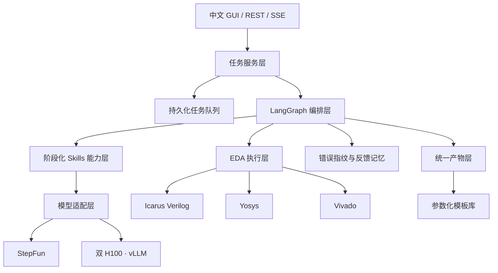
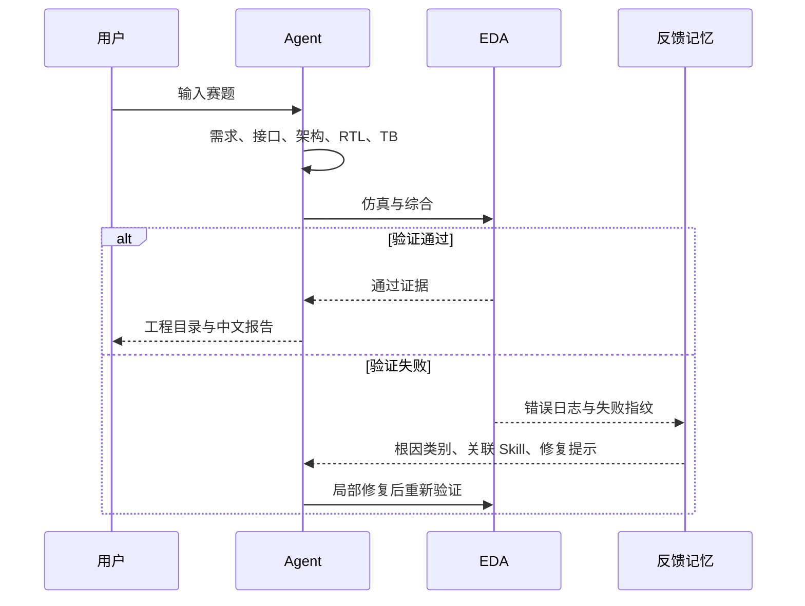

# SiliconForge 系统架构与设计原理

## 1. 设计目标

SiliconForge 把数字 IC 设计从“模型生成一段 Verilog”提升为“可验证、可修复、可复用的工程交付”。系统以自然语言赛题为入口，以可综合 RTL、自检 Testbench、EDA 证据和中文报告为出口。每个环节都通过结构化状态连接，使生成、验证、修复与沉淀形成同一个闭环。

## 2. 分层架构

### 交互层

Web GUI 负责赛题输入、任务状态、产物预览、代码编辑、模板实例化、报告下载和个性化主题。SSE 将任务变化实时推送给浏览器，长时间运行的 EDA 和模型步骤不需要反复刷新页面。

### 任务服务层

API 只面向任务服务，不直接拼接工作流内部节点。任务记录保存输入、执行策略、输出路径、状态、错误与重试关系，因而 CLI、GUI 和 benchmark 可以复用同一条执行链路。

### 编排层

LangGraph 将需求分析、架构设计、规格生成、RTL 生成、TB 生成、预检查、仿真、综合、审查和修复表示为显式状态图。节点之间传递 Pydantic 约束的结构化对象，降低自由文本在多阶段传递中的信息漂移。

### Skills 能力层

Skills 不是单一长提示词，而是按任务阶段选择的工程约束集合：

1. 时钟与复位纪律；
2. 接口、握手和背压契约；
3. FSM 状态与寄存器 ownership；
4. 位宽、有符号数和算术溢出；
5. BRAM、DSP、流水线等资源推断；
6. 延迟、可观测性与断言；
7. Testbench 外部激励和自检；
8. 以根因为中心的局部修复。

Skill 包通过 Catalog、静态扫描、评测结果和运行证据生成 `skill_card.json` 与 `security_report.json`，使比赛强调的 Verified Skills 架构在项目中落到可检查的交付物上。

### 模型适配层

模型客户端封装 OpenAI-compatible 协议。Windows 开发环境可调用 StepFun，双 H100 服务器通过 vLLM 提供相同接口，因此工作流和提示词无需随部署平台改写。调用链包含硬超时、指数退避、多次重试和降级模型选择。

### EDA 执行层

生成结果先经过语法和接口预检查，再进入 Icarus Verilog 仿真与 Yosys 综合；Vivado 适配用于 FPGA 工程路径。工具返回码、stdout、stderr 和报告被完整纳入任务状态，成为修复节点的输入和最终报告的证据。

## 3. 反馈闭环

失败信息被映射为稳定错误类别，例如接口不一致、位宽截断、驱动冲突、复位不完整、时序偏移或 TB 可观测性不足。系统优先修改与根因直接相关的最小区域，避免一次修复引入大范围回归。聚合后的经验写入反馈记忆，在后续任务构造提示词时自动注入。

## 4. 模板复用

模板库把高频数字 IC 结构保存为带参数、端口约定、RTL、TB 和验证元数据的工程资产。模板实例化不调用大模型，可以显著降低延迟和 Token 消耗。对于模型生成且通过质量门的任务，系统提取 Verilog `parameter` 并生成个人模板记录，实现“设计一次、验证一次、长期复用”。

## 5. 产物与可追溯性

每个任务采用固定交付目录，`run_manifest.json` 记录输入、运行时、文件清单与哈希；规格、架构、Skill 卡、EDA 日志、反馈报告和最终说明书互相引用。GUI 中看到的状态、下载 ZIP 与服务器上的任务目录来自同一份记录，从而保证演示界面与真实工程结果一致。

## 6. 关键工程优化

- 模型输出采用结构化契约，减少跨节点解析失败。
- 先进行确定性预检查，再调用高成本 EDA 和模型修复。
- 修复轮次继承规格、源码、工具日志和历史差异。
- 通用模型链路设置超时、退避与降级，提升长任务稳定性。
- 高频设计走模板快路径，开放任务走生成与验证路径。
- benchmark 将题目与 oracle 分离，避免把答案暴露给 Agent。
