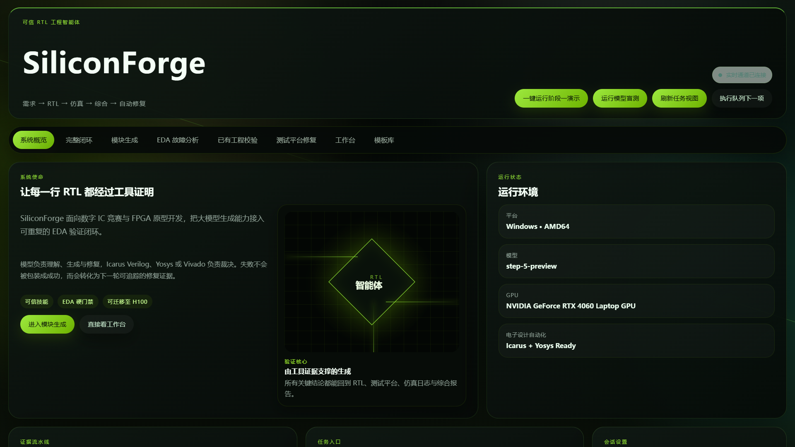
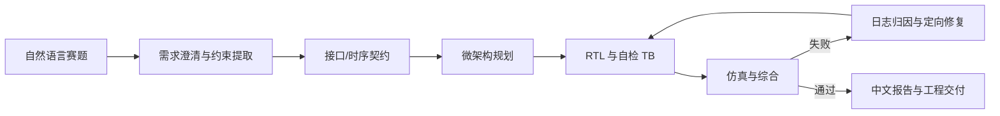
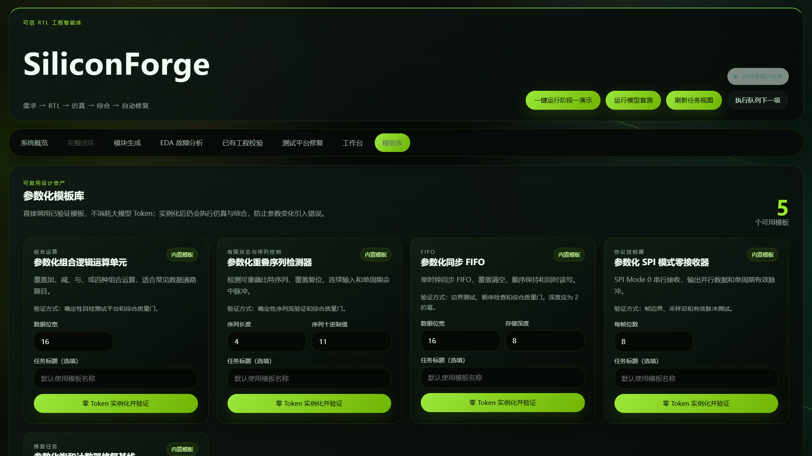
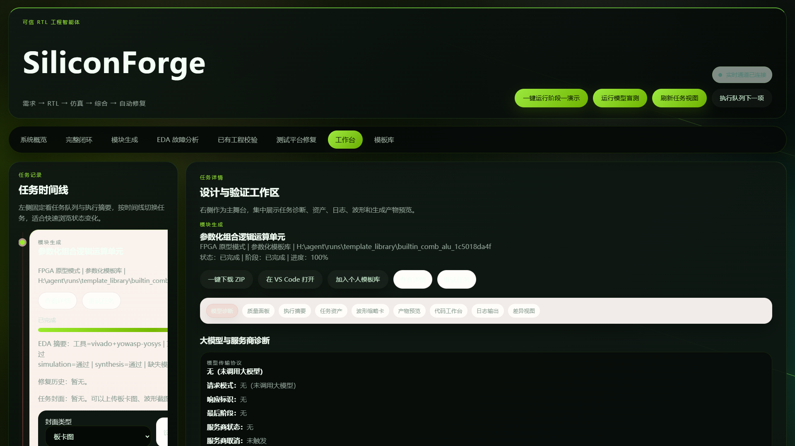
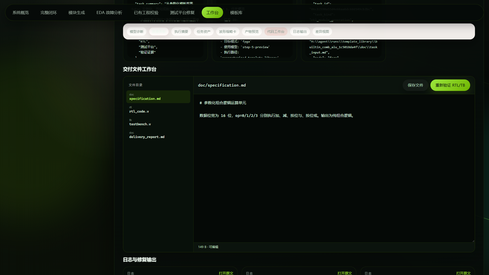
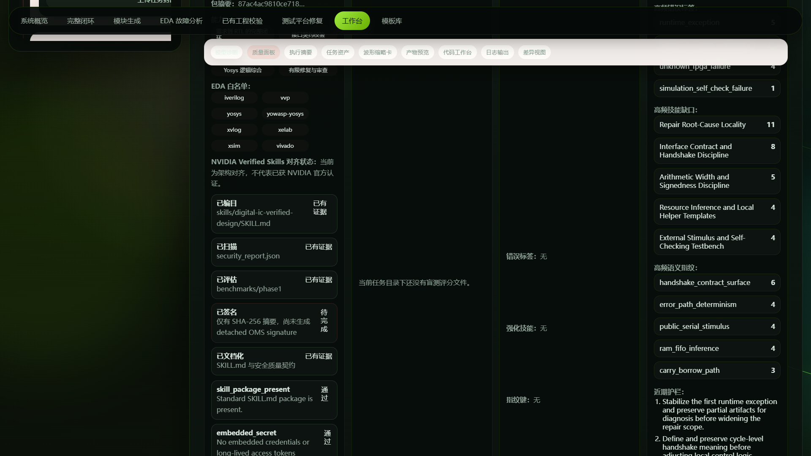
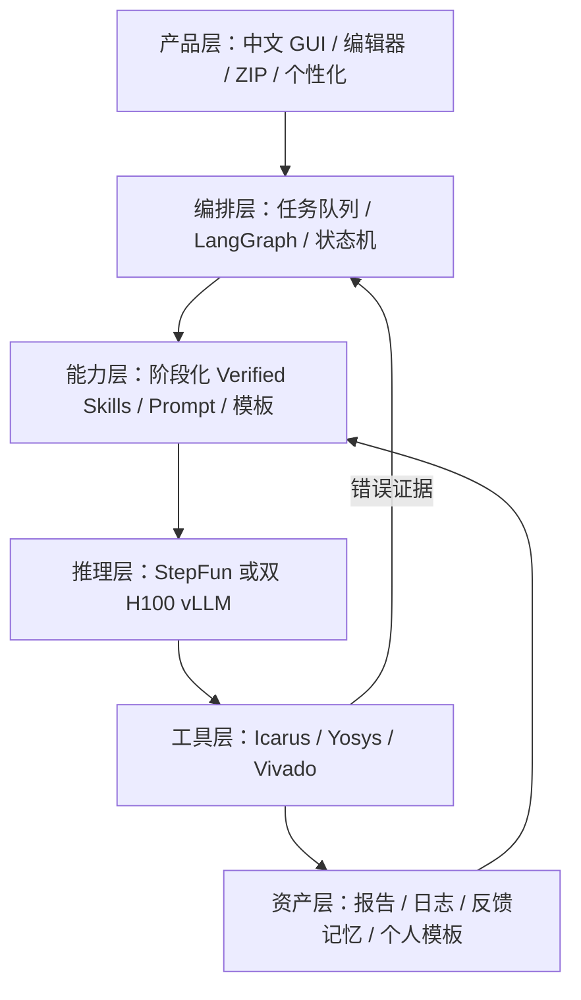
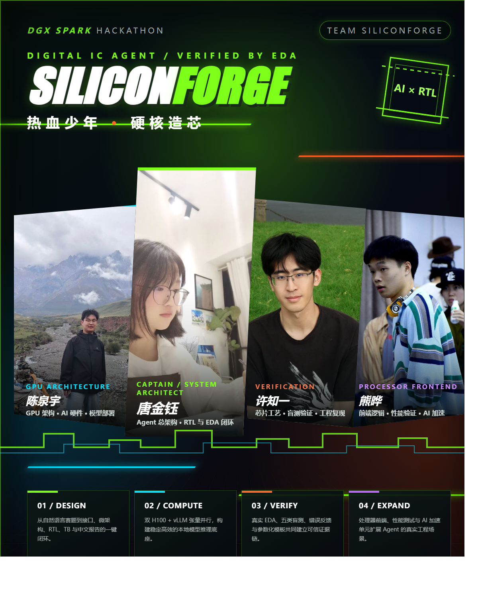

# 黑客松十日谈：我们如何把“会写 Verilog 的大模型”炼成一台可验证的数字 IC Agent

> **项目名称：** SiliconForge · 数字 IC 智能体  
> **关键词：** Agent、数字 IC、RTL、EDA 闭环、Verified Skills、NVIDIA H100、vLLM  
> **适合读者：** 数字 IC/FPGA 开发者、Agent 工程师、AI for EDA 研究者、黑客松参赛团队

## 写在前面：真正困难的不是生成代码，而是交付可信工程

如果把一道数字 IC 赛题直接交给大模型，它通常能很快写出一段“看起来像 Verilog”的代码。然而，工程师真正关心的问题远不止这些：端口方向是否正确？复位是同步还是异步？有符号数有没有被意外转成无符号数？FIFO 的满空边界是否存在 off-by-one？Testbench 是否真的自检，而不是只打印几行波形？代码能否通过仿真和综合？失败后系统能否读懂日志并有针对性地修复？最终能否形成一份别人可以下载、复现和继续编辑的工程？

SiliconForge 就是在这一连串追问中演化出来的。最初，它只是半年前为数字 IC 比赛制作的一个 Agent 原型；十天密集迭代后，它逐步成为一套从自然语言赛题出发，自动完成需求分析、接口与时序契约、微架构设计、RTL 与 Testbench 生成、真实 EDA 验证、错误归因、定向修复、中文报告和工程打包的闭环系统。

这篇“十日谈”不只记录功能列表，更希望复盘我们的判断为何一次次改变：为什么单一 Prompt 不够，为什么必须接入真实工具，为什么模板库不是“作弊题库”，为什么 Skills 需要治理，以及为什么一个能跑通的 Demo 还必须成为一个可迁移、可解释、可复现的产品。



## 第一天：从“固定模型调用”开始，先让旧工程重新活起来

第一天的目标很朴素：确认半年前的工程还能否完整运行，并把推理模型统一接到阶跃星辰的 OpenAI-compatible 接口。我们梳理了 CLI、FastAPI、网页入口、工作流节点和模型传输方式，重新打通 Windows 本地开发链路。

这一步很快暴露出产品与脚本之间的断层。命令行可以执行，不代表用户能使用；网页能打开，也不代表“一键提交赛题”真的成立。最典型的问题是：前端允许用户只写一句标题，后端契约却要求必须提供完整需求文本或任务文件。界面上的“设计一个 FIFO”在人看来已经是明确意图，在接口看来却是空请求。

于是我们确立了第一个原则：**自然语言入口必须对用户宽容，内部工程契约必须对执行严格。** 标题、描述、附件可以由入口层归一化；进入工作流后，则必须形成结构化需求、端口假设和验收条件。Agent 的价值之一，就是替用户完成从模糊赛题到严格工程契约的转换，而不是把这份工作退回给用户。

## 第二天：重新理解赛题——重点不是“用了一个大模型”

直播答疑和比赛材料反复提到 Verified Skills、安全治理、DGX Spark 和多模型协同。我们最初也疑惑：所谓“安全架构”，是不是只要套一层 Skill 文件就能得分？深入拆解后，我们的理解变得更具体。

在这个项目里，安全并不仅指网络攻击或密钥保护，更重要的是 **Agent 行为的可约束、可审计与可复现**。如果模型可以在没有边界的情况下任意生成命令、读取文件和修改工程，那么即使偶尔得到正确 RTL，也很难说明结果为什么可信。Verified Skills 的意义，是把能力拆成带有输入前提、权限边界、工具范围、验收标准和失败处理的工程单元。

因此，我们把数字 IC 经验整理为阶段化 Skills：时钟复位、接口握手、位宽与符号、FSM 状态归属、资源推断、可观测性、自检 Testbench、错误分类和局部修复。每个阶段只获得完成当前任务所需的上下文和工具，执行结果还要接受真实 EDA 的判定。比赛需要展示的，不是“模型很聪明”，而是模型、工具、规则和证据如何组成可靠系统。

## 第三天：一键输入赛题，由 Agent 自己设计接口

用户最原始的诉求一直很清晰：输入赛题，一键跑完整个流程。既然如此，接口契约就不应该要求用户预先写好。我们把工作流从“生成 RTL”向前扩展为以下链路：



例如“设计一个 66×66 乘法器”，系统需要主动确定输入输出位宽、组合还是流水、是否有 valid/ready、结果位宽、延迟定义、是否使用有符号运算，并把假设写入规格文档。对于信息不足的题目，Agent 会采用可解释的默认值，而不是悄悄生成一份不可验证的代码。

这一改变把 Agent 从代码补全器提升为初级设计协作者：它先回答“要设计什么”，再回答“怎么实现”。

## 第四天：接入真实 EDA，建立生成—验证—修复闭环

只看代码文本无法证明 RTL 正确。我们接入 Icarus Verilog、Yosys，并保留 Vivado 适配路径：Icarus 负责快速编译与行为仿真，Yosys 负责可综合性和基础统计，Vivado 面向 FPGA 工程提供进一步实现能力。

工作流不再以“模型输出结束”为终点，而以质量门是否通过为终点。失败日志会被分类为语法、端口、位宽、时序、功能、工具链等错误，再将最相关的代码片段、契约和错误证据送入修复节点。局部错误优先局部修复，避免每次推倒重来造成新回归；超过预算时，系统保留完整失败证据，而不是伪装成功。

这也是 66×66 乘法器问题真正的答案：稳定生成不是靠把题目写进 Prompt，而是依靠明确的算术契约、参数化实现、自检 oracle、综合检查和可重复回归。

## 第五天：调研论文与开源工程，把“经验”变成架构

我们进一步调研了 VerilogEval、RTLLM、AutoChip、ChatEDA、Reflexion、ChipNeMo 等论文和工程实践，也比较了代码 Agent 常见的规划、执行、反思、工具调用与记忆范式。最大的收获有三点。

第一，**Prompt 应当分阶段，而不是写成一篇万能作文。** 需求分析阶段关注接口与验收，微架构阶段关注数据通路和控制通路，RTL 阶段关注可综合编码，TB 阶段关注 oracle 和边界覆盖，修复阶段只处理证据指向的问题。不同阶段共享结构化契约，而不是共享全部对话噪声。

第二，**反馈必须来自可执行证据。** “请再检查一下代码”是一种弱反思；编译器第 37 行的类型错误、某个随机向量的期望值与实测值、综合后锁存器数量，才是可以驱动定向修复的强反馈。

第三，**评价集必须与生成上下文隔离。** 因此我们建立了组合运算、FSM、FIFO、协议控制器和 RTL 修复五类盲测。Agent 只看到题目，独立 Testbench/oracle 在结果产生后评分，从而衡量 Pass@1、修复成功率、闭环耗时和交付完整度，而不是衡量“它是否背过示例”。



## 第六天：把散落文件变成真正的工程交付

早期产物散落在运行目录中，开发者勉强能找，演示者和普通用户却很难理解。我们重新定义了统一交付结构：

```text
runs/<task-id>/
├─ rtl/   # 可综合 RTL
├─ tb/    # 自检 Testbench
├─ doc/   # 规格、架构、交付报告、Skill 卡
├─ logs/  # 模型、仿真、综合、修复日志
├─ meta/  # manifest、反馈、质量证据
└─ eda/   # EDA 中间结果与报告
```

GUI 增加了类似 VS Code 的文件树和文本编辑器：用户可以查看 RTL/TB/报告，保存修改后重跑 EDA，也可以一键下载完整 ZIP。这样，Agent 的输出不再是一段聊天记录，而是一个具有清晰目录、证据链和后续开发入口的工程包。





## 第七天：五类盲测继续保留，但高频设计进入参数化模板库

五类盲测的意义不是保证“只要输入这五类题就永远正确”，而是建立覆盖数字设计核心风险的可重复测量基线：组合逻辑考察位宽和符号，FSM 考察状态转移与时序，FIFO 考察指针和满空边界，协议控制器考察握手与背压，修复任务考察错误定位和最小修改能力。

与此同时，FIFO、计数器、仲裁器、乘法器等设计确实高度常见。每次都让大模型从零生成既浪费 Token，也降低确定性。因此我们加入参数化模板库：通过位宽、深度、流水级数、复位方式等参数直接实例化经过验证的 RTL/TB；一次高质量生成也可以由用户审核后一键沉淀为个人模板。

于是系统形成了三条路径：成熟任务优先零 Token 模板实例化；相似任务检索既有资产并做受控适配；新颖任务才进入完整模型生成和验证闭环。模板不是跳过验证，而是复用已经验证过的结构，并对新参数重新运行 oracle。这也成为项目的重要个性化亮点——每位工程师都能逐渐拥有适合自己场景的数字 IC 助手。

## 第八天：让失败变成下一次成功的资产

重试并不等于把相同请求再发一遍。我们为通用模型路径加入超时、指数退避、瞬态错误重试和降级模型机制，并为设计闭环加入失败指纹记忆：错误类别、触发条件、关联 Skill、采用的修复策略和最终结果都会被结构化记录。

当相似问题再次出现时，系统可以优先注入相关经验。例如检测到有符号乘法的符号扩展错误，就重点检查 `$signed` 转换与结果位宽；检测到 FIFO 空满同时为真，就优先检查指针比较和环绕位。记忆不是无限堆积对话，而是把失败压缩成可检索、可验证的工程知识。



## 第九天：GUI 不只是“好看”，它是能力解释器

一个比赛作品需要让评委在几十秒内理解价值。我们多次调整界面：从能打开网页，到中文工作台；从分散输出，到文件树；从只有按钮，到实时进度、质量门、报告和下载；最终保留暗色科技风，加入个人照片、3D 旋转相册以及本地一键换图功能。

个性化不是纯装饰。SiliconForge 希望表达的产品定位，是“每个人都可以训练出属于自己的工程助手”。上传照片会在浏览器本地压缩并保存，不改变 Agent 执行逻辑；模板资产、反馈经验和技能配置则负责真正的能力个性化。视觉层和能力层共同让这个概念变得直观。

## 第十天：从 Windows 原型走向双 H100 与公开交付

我们的策略是先在 Windows 上把完整产品跑通，再迁移到实验室双 H100 服务器。最终，Agent 服务与模型服务被解耦：FastAPI/LangGraph 容器负责 GUI、编排、任务队列和 EDA；vLLM 容器通过张量并行使用两张 H100，并提供 OpenAI-compatible 推理接口。Docker Compose、环境变量、健康检查和便携压缩包保证同一份工程可以在开发机与服务器之间迁移。

这里也必须澄清一个常见误解：**访问者不需要 H100。** H100 是服务端算力。只要服务器具有公网 IP/域名，或通过 VPN、FRP、Cloudflare Tunnel、Tailscale 等方式穿透实验室网络，上海的同学只需打开浏览器即可使用。当前的 `http://127.0.0.1:8000` 只代表“本机回环地址”，外地用户当然无法访问它。

公开部署还有另一种轻量形态：在普通 CPU 云服务器上运行 Agent、EDA 和网页，每位用户填写自己的阶跃星辰 API Key，模型推理由云端 API 完成，因此不要求本地 GPU。GitHub 负责托管源码，但 GitHub Pages 无法运行 Python 后端、EDA 工具和模型服务；真正的在线体验仍需一台持续运行的服务器。

我们还加入了额度隔离：公开模式默认不向普通用户共享项目所有者的付费 API Key；用户使用远程模型时需提供自己的会话级配置。双 H100 本地 vLLM 则可以显式开启共享，因为它消耗的是服务器本地算力而非个人 StepFun 额度。

## 十天后的架构：五层能力与一条证据链



回看整个演进，SiliconForge 经历了五个明显阶段：

| 阶段 | 系统形态 | 核心问题 | 关键变化 |
|---|---|---|---|
| V0 | Prompt 包装器 | 只能给出代码文本 | 固定模型与基本工作流 |
| V1 | 赛题工作流 | 用户仍需补接口 | Agent 自动建立需求与时序契约 |
| V2 | EDA Agent | 正确性不可证明 | 仿真、综合、日志归因与修复闭环 |
| V3 | 技能化平台 | 经验不可复用 | Verified Skills、盲测、反馈记忆、模板库 |
| V4 | 可交付产品 | 难演示、难迁移 | 中文 GUI、编辑器、ZIP、Docker、双 H100 |

## 四位跨学科成员，如何完成任务分工

### 唐金钰｜队长、Agent 总架构与 RTL 闭环负责人

广东工业大学集成电路工程硕士二年级，研究方向为加密芯片设计，对 Agent 工程、数字 IC 自动化与软硬协同具有浓厚兴趣。获 2026 年复微杯全国一等奖，DATE 论文在投。项目中负责产品定义、Agent 总体架构、RTL/TB 生成链路、提示词与 Skills 设计、EDA 反馈闭环、GUI 叙事和比赛交付统筹。个人站点：[github.com/tang-jinyu](https://github.com/tang-jinyu)，小红书 ID：396028779。

### 陈泉宇｜GPU 架构、模型部署与性能工程负责人

上海科技大学博士研究生，研究方向为计算机体系结构与 AI 硬件，主要从事低温 GPU 架构及模拟方法研究，研究兴趣覆盖 AI 加速器、GPGPU 与低温计算。项目中负责双 H100/vLLM 部署、张量并行配置、推理吞吐与显存分析、模型服务稳定性、性能 profiling，以及从 GPU/AI 硬件视角优化 Agent 的本地推理链路。

### 许知一｜验证评测、工艺约束与可复现工程负责人

上海交通大学硕士研究生，聚焦深低温高精度传感器的工艺设计、器件制备与性能验证，具备集成电路工艺和微纳器件研发经验，并具有较强的跨学科学习与工程落地能力。项目中负责五类盲测设计、质量门与结果审查、边界条件和可靠性测试、工艺/器件约束知识补充、实验记录、文档复现及演示数据核验。

### 熊晔｜处理器前端、性能验证与 AI 加速场景负责人

广东工业大学本科三年级学生，现于北京开源芯片研究院实习，主要关注处理器前端逻辑与体系结构设计、处理器性能验证测试及 AI 加速单元设计，对 Agent 辅助 IC 设计开发流程具有浓厚兴趣。项目中负责补充处理器前端模块与 AI 加速单元案例、设计性能测试方法、扩展微架构指标和验证场景，并参与工程演示的影像创作与传播表达。技术之外擅长街舞与摄影，期待和更多伙伴交流舞蹈、AI 与芯片设计。



这样的分工不是把软件、硬件和材料简单切开，而是形成互补：唐金钰负责让系统“能设计、能闭环”，陈泉宇负责让模型“能在双 H100 上稳定高效运行”，许知一负责让结果“可验证、可复现、能经受工程追问”，熊晔负责把能力延伸到处理器前端、性能测试与 AI 加速的真实场景。

## 我们最终学到的三件事

**第一，Agent 的上限不只由模型决定，也由环境反馈的质量决定。** 对数字 IC 而言，编译器、仿真器、综合器和独立 oracle 比泛泛的自我反思更有价值。

**第二，高质量生成来自契约、分工和验证，而不是一条越来越长的 Prompt。** 把需求、架构、实现、测试和修复拆成职责明确的阶段，才能控制上下文、定位错误并积累经验。

**第三，真正可持续的个人 Agent 必须同时拥有通用推理与私有资产。** 模型处理新问题，参数化模板复用成熟结构，反馈记忆沉淀失败经验，用户审核决定什么值得进入自己的知识库。

十天并没有让数字 IC 设计变成“按一下按钮就永远正确”的魔法，却让一条原本不可控的文本生成路径，变成了一条有规格、有工具、有反馈、有证据、有交付物的工程流水线。对我们而言，这正是 Agent 从 Demo 走向生产工具、从“会回答”走向“能负责”的关键一步。

---

**推荐标签：** `NVIDIA` `DGX Spark` `Agent` `数字IC` `FPGA` `Verilog` `EDA` `大模型` `H100` `vLLM`

