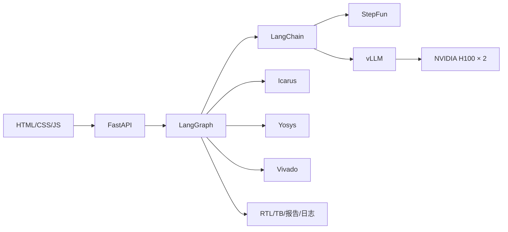

# SiliconForge 技术栈说明

## 1. 智能体与后端

| 技术 | 项目中的职责 |
|---|---|
| Python 3.11+ | Agent、EDA 编排、任务服务和工具链集成 |
| LangGraph | 用显式状态图组织需求、生成、验证、修复和审查节点 |
| LangChain | 模型消息、结构化输出与 OpenAI-compatible 适配 |
| FastAPI | REST API、文件上传下载、会话与静态 GUI |
| Pydantic | 请求、任务状态、中间产物和 API 响应的数据契约 |
| Uvicorn | ASGI 服务运行时 |
| SSE | 实时推送队列和任务状态变化 |

## 2. 模型与 NVIDIA 平台

| 技术 | 项目中的职责 |
|---|---|
| NVIDIA H100 × 2 | 生产环境本地大模型推理算力 |
| CUDA / NVIDIA Driver | GPU 执行环境 |
| NVIDIA Container Toolkit | Docker 容器访问两张 H100 |
| vLLM | OpenAI-compatible 模型服务与张量并行推理 |
| Tensor Parallel = 2 | 在两张 H100 之间切分模型计算与显存占用 |
| StepFun | Windows 开发和远程模型路径 |

本地 H100 与 StepFun 对 Agent 暴露一致的 OpenAI-compatible 接口。模型提供商的切换由环境变量完成，LangGraph、Skills、EDA 和 GUI 保持不变。

## 3. 数字 IC 与 EDA

| 技术 | 项目中的职责 |
|---|---|
| Verilog/SystemVerilog | RTL 与 Testbench 的主要交付语言 |
| Icarus Verilog / VVP | 编译、事件仿真和自检 TB 执行 |
| Yosys | RTL 综合、结构检查和资源报告 |
| Vivado | FPGA 工程、Xilinx 器件综合与实现适配 |
| Oracle Testbench | 对盲测结果进行独立判分 |

工具层使用进程超时、返回码、标准输出和标准错误构造统一 EDA 结果。修复节点直接读取真实日志，定位接口、语法、行为或综合问题。

## 4. Agent Skills 与提示词工程

项目把知识组织为三类资产：

1. `skills/`：可审计、可扫描、可生成说明卡的标准 Skill 包；
2. `project_prompt/`：按工作流阶段组装的系统提示词与反馈记忆；
3. `prompt/`：RTL、Testbench、仿真修复等专项工程资料。

Skills 在相应节点按需注入，提示词明确输入契约、输出结构、工程守则和失败模式。反馈记忆将 EDA 失败映射回 Skill 类别，使提示词随真实运行证据不断强化。

## 5. 前端与交互

| 技术 | 项目中的职责 |
|---|---|
| HTML5 | 单页 GUI 结构 |
| CSS3 | 响应式布局、玻璃拟态、3D 旋转相册和动效 |
| JavaScript | API 调用、SSE、文件树、编辑器、照片处理和模板交互 |
| Canvas | 上传照片的浏览器端缩放与压缩 |
| LocalStorage | 保存用户选择的个人主题照片 |

前端不依赖构建工具，FastAPI 可直接托管静态文件，适合 Windows 开发和 Docker 生产部署使用同一套界面。

## 6. 工程与质量体系

| 技术 | 项目中的职责 |
|---|---|
| Docker / Compose | Agent、vLLM、GPU 和持久化目录编排 |
| PowerShell | Windows 引导、启动、便携打包和演示脚本 |
| unittest | 服务、工作流、产物、模板和回归测试 |
| Playwright | GUI 与浏览器交互回归 |
| JSON / Markdown | 结构化证据、报告和人类可读交付 |
| ZIP / SHA256 | 完整任务下载与便携包一致性校验 |

## 7. 关键依赖关系

