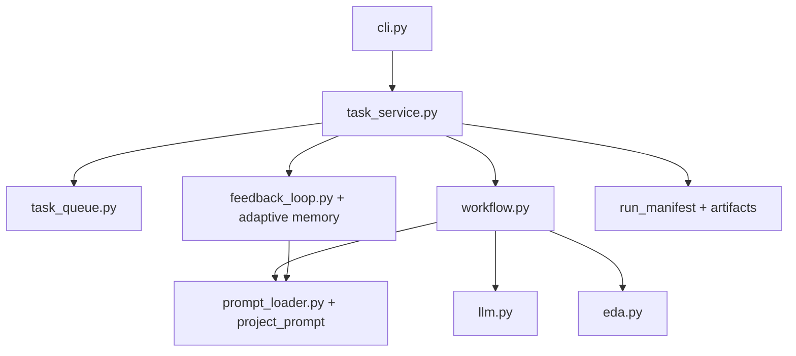

# 平台分层与任务模型

这份文档描述从 CLI 原型走向可安装 agent 平台的拆分方式，重点是任务模型、服务层、队列层，以及未来 UI/API 的接入位置。

## 当前分层

## 新的任务模型

当前已经落地的任务模型由三部分组成：

- `AgentTaskRequest`: 一次任务提交请求，包含标题、需求文本、输入文件、输出目录、模式、dry-run 标志和元数据。
- `AgentTaskRecord`: 任务的生命周期记录，包含 pending/running/succeeded/failed 状态与时间戳。
- `AgentTaskExecution`: 一次执行完成后的结果，包含任务记录、workflow 状态和 manifest。

这套模型的目的不是为了当前 CLI 看起来更整齐，而是为了给三个入口复用：

1. CLI 同步执行。
2. 本地队列 worker。
3. 未来的 API/UI 提交与查询。

## 服务层职责

`task_service.py` 现在承担四件事：

1. 接收统一的 `AgentTaskRequest`。
2. 为 workflow 准备输入文件和运行目录。
3. 调用 `run_workflow` 完成真实执行。
4. 把产物统一落盘并生成 manifest。

现在它还额外承担一个“反馈闭环桥接”职责：

5. 在任务完成或失败后，把 precheck、仿真、综合和异常信息归档成反馈报告，并更新 repo 内的自增 FPGA 记忆文件。

这意味着 CLI 不再拥有工作流细节，后续 API/UI 也不需要重复写一遍运行逻辑。

## 队列层职责

`task_queue.py` 当前是本地文件队列，属于过渡形态。它已经足够支持：

1. 任务提交。
2. 队列列表。
3. worker claim-next 并执行。

它还不具备下面这些产品级能力：

- 并发锁。
- 优先级。
- 取消与重试策略。
- 资源配额。
- 多 worker 协调。
- 崩溃恢复与心跳。

因此当前队列层是“平台接口已拆开，但后端实现仍是最小版本”。

## API 层应该怎么接

未来 API 层不应该直接调用 `workflow.py`，而应该只做下面几件事：

1. 把 HTTP 请求转换成 `AgentTaskRequest`。
2. 调用 `AgentTaskService.enqueue()` 或 `AgentTaskService.run_sync()`。
3. 查询 `AgentTaskRecord` 和产物摘要后返回给前端。

这样 API 层只做传输协议，不做业务编排。

## UI 层应该怎么接

UI 层不应该理解 LLM、EDA 或 repair 细节。UI 的职责应该是：

1. 提交任务。
2. 查看任务状态。
3. 查看产物差异和日志摘要。
4. 触发重试、继续 repair 或导出报告。

也就是说，UI 应该消费“任务状态”和“产物摘要”，而不是直接操纵 workflow 节点。

## 规则层应该怎么接

`rules.py` 的意义是把原先散落在 workflow 各节点里的经验约束收敛成共享策略。后续应该继续按下面方式扩展：

1. 按任务类型组织规则，而不是按单一案例组织。
2. 把“生成约束”“修复约束”“预检规则”“报告规则”分开。
3. 让 prompt、precheck、review 都复用同一套规则语义，而不是分别维护不同版本的文字。

现在 FPGA 这条线已经开始把“规则层”再往前推进一层：

1. 用 stage-aware skill registry 组织 FPGA 知识，而不是只靠长 system prompt。
2. 用 feedback memory 把重复失败模式回写到 prompt 入口，而不是只把日志留在 run 目录里。
3. 用 benchmark suite 把规则质量变成可以量化追踪的分数。

## 现在适合继续做什么

从平台化角度，接下来最合理的顺序是：

1. 补一个轻量 API 适配层，直接复用 `AgentTaskService`。
2. 把任务记录摘要化，形成 UI 可直接消费的状态对象。
3. 把当前 workflow 从“单数字 IC 闭环”扩展到多个任务类型。
4. 把文件队列替换成真正的 worker backend。
